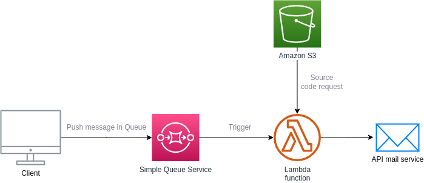

# Serverless AWS transactional mailer


## DESCRIPTION :

This project shows how to send transactional email asynchronously by Sendinblue API from AWS lambda and AWS SQS

If you don't want to use Sendinblue you can adapt the lambda function in *src/send_email_sendinblue.py* and *requirements.txt*

### Setup cloud environment
- Create queue on AWS SQS [doc](https://docs.aws.amazon.com/AWSSimpleQueueService/latest/APIReference/API_CreateQueue.html)
- Create bucket on AWS S3 [doc](https://docs.aws.amazon.com/AmazonS3/latest/userguide/creating-bucket.html)
- Register and create template email on Sendinblue [doc](https://help.sendinblue.com/hc/en-us/articles/360019787120-Cr%C3%A9er-un-template-d-email)
- Define secret variables
```bash
aws ssm put-parameter --name API_KEY_SERVERLESS --value ${API_KEY_SERVERLESS} --type SecureString
aws ssm put-parameter --name S3_BUCKET --value ${S3_BUCKET} --type SecureString
aws ssm put-parameter --name QUEUE_URL --value ${QUEUE_URL} --type SecureString
aws ssm put-parameter --name QUEUE_ARN --value ${QUEUE_ARN} --type SecureString

aws ssm put-parameter --name SENDINBLUE_API_KEY --value ${SENDINBLUE_API_KEY} --type SecureString
```
- Deploy your function
```bash
npm install -g serverless
sls plugin install -n serverless-python-requirements
sls deploy --verbose --conceal
```

### Cloud architecture :




# Files structure

```
Serverless-AWS-transactional-mailer
 │
 ├── src
 │   └── send_email_sendinblue
 │        └── send_email_sendinblue.py
 │
 ├── test
 │    └── test_mailer.py
 │
 ├── requirements.txt
 │
 ├── serverless.yml
 |
 └── ressources
```